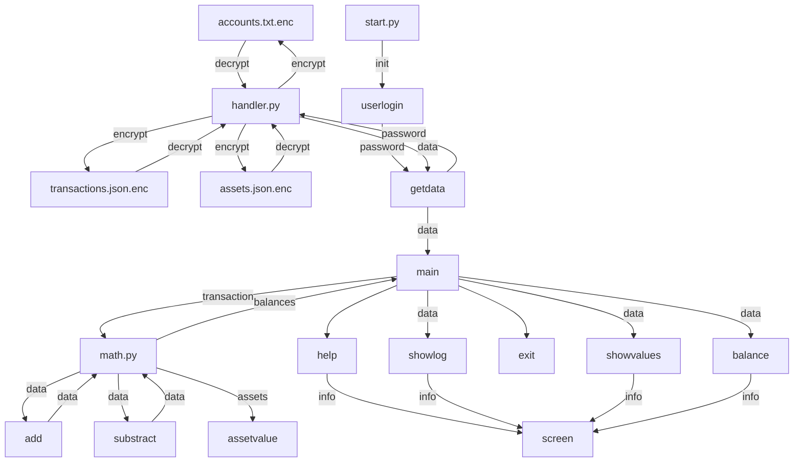

```mermaid

graph TD
    B[accounts.txt.enc]
    C[transactions.json.enc]
    D[assets.json.enc]
    E[userlogin]
    H[handler.py]
    I[getdata]
    J[main]
    K[add]
    L[substract]
    M[math.py]
    N[showlog]
    O[showvalues]
    P[exit]
    Q[help]
    R[screen]
    S[balance]
    T[start.py]
    U[assetvalue]

    T -->|init| E
    B -->|decrypt| H
    C -->|decrypt| H
    D -->|decrypt| H
    H -->|encrypt| B
    H -->|encrypt| C
    H -->|encrypt| D
    E -->|password| I
    I -->|password| H
    H -->|data| I
    I -->|data| J
    M -->|data| K
    K -->|data| M
    M -->|data| L
    L -->|data| M
    J -->|transaction| M
    M -->|balances| J
    J -->|data| N
    J -->|data| O
    J --> P
    J --> Q
    Q -->|info| R
    N -->|info| R
    O -->|info| R
    J -->|data| S
    S -->|info| R
    M -->|assets| U

```